**Az Web App Demo .**

1. Run and build the project and make sure it is running on your local machine.
2. Create a new Web App on Azure Portal.
   
   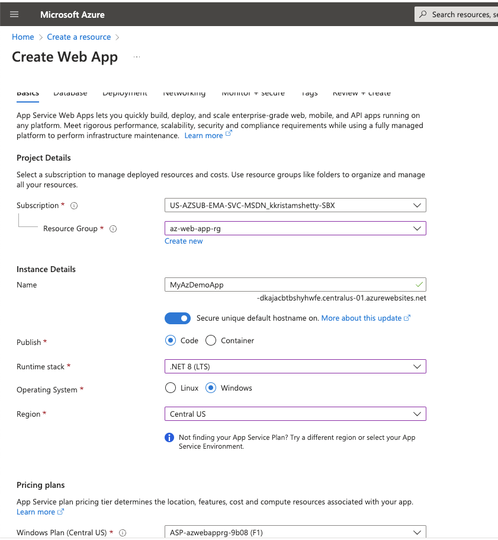
   
   ```
   Choose Subscription , Resource Group , App Name (say MyAzDemoApp), Runtime Stack (say .net 8) , Region (say Central US) , Windows Plan , Sku and click on Review + Create.
   ```
4. Navigate to Monitor + Secure and click no for Enable Application Insights.
   
   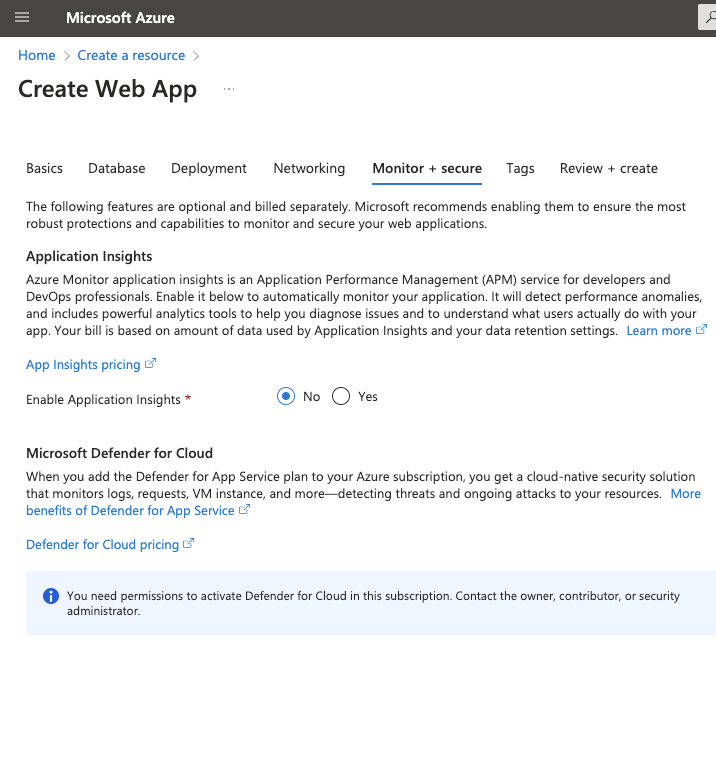
5. navigate to Review + Create and click on Create.
   
   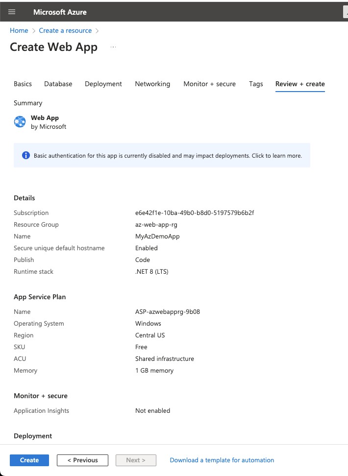
6. Once the deployment is successful, navigate to the resource and click on the URL to see the deployed web app.(say : myazdemoapp-dkajacbtbshyhwfe.centralus-01.azurewebsites.net)
   
   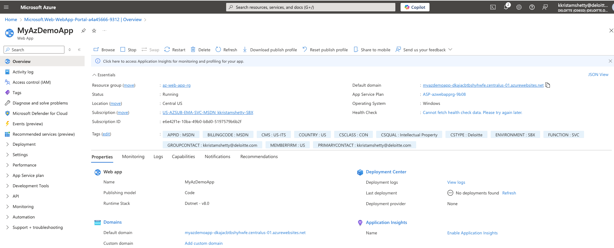
7. You can see the sample web app running on Azure. (at myazdemoapp-dkajacbtbshyhwfe.centralus-01.azurewebsites.net)
    
   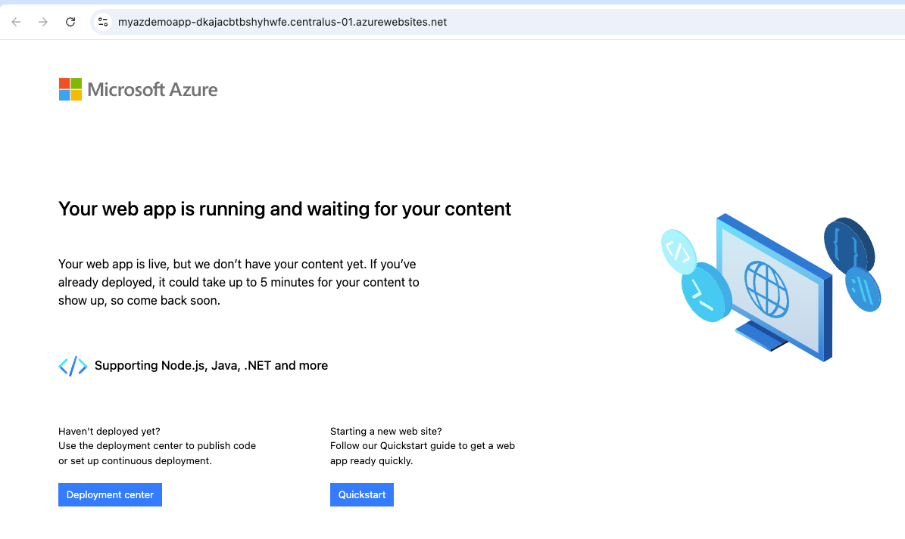
8. Now, let's deploy our local web app to Azure Web App.

9. Navigate to the project folder and open the terminal.

10. Run the below command to publish the project to a folder named Publish.
   ```
    dotnet publish -c Release -o ./bin/Publish
   ```

11. You can see the published files in the bin\Publish folder.
    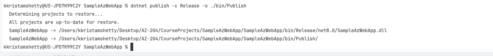
12. Now, let's deploy the published files to Azure Web App. 
    Select the Publish folder --> Tools --> Azure --> Deploy to Azure Web Apps.
    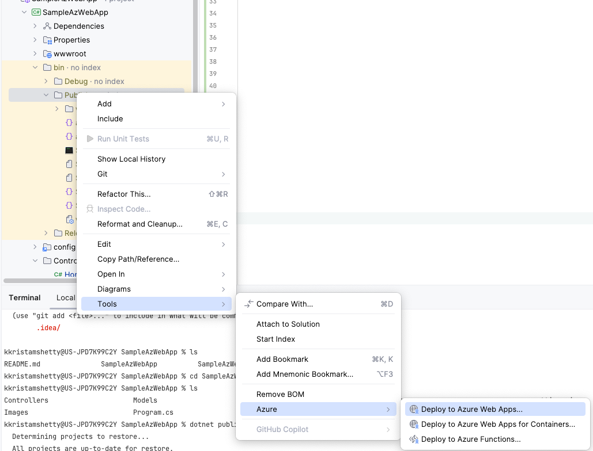
13. Select the Web app from the web apps and click on Run
    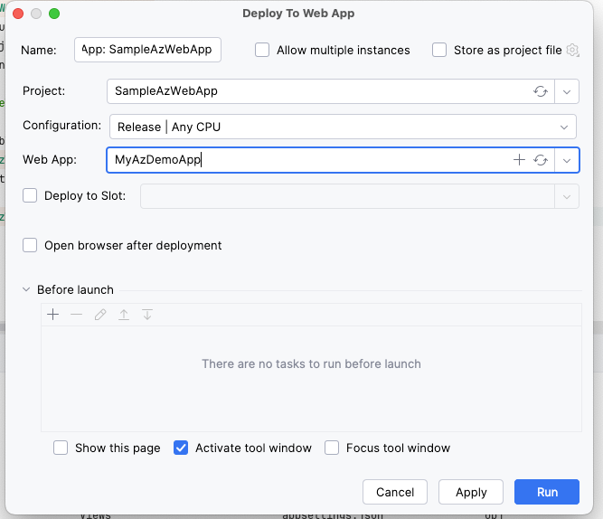
14. You should see the terminal running the deployment and once it is successful, you can see the web app running on Azure.
    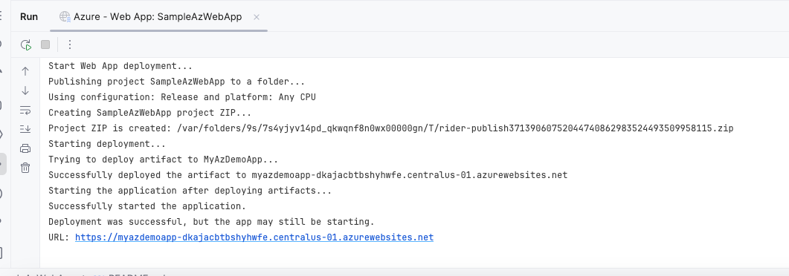
15. Now switch to the previous url, (https://myazdemoapp-dkajacbtbshyhwfe.centralus-01.azurewebsites.net) and you can see the deployed web app running on Azure.
    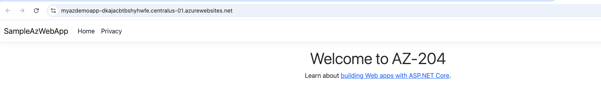

**Azure SQL Database Service**
1. From Azure portal, click on Create a resource and search for SQL Database.
2. Click on Create and fill in the details like Subscription, Resource Group, Database name, Server, Server admin login, Password, Location, Compute + Storage, Collation, and click on Review + Create.

   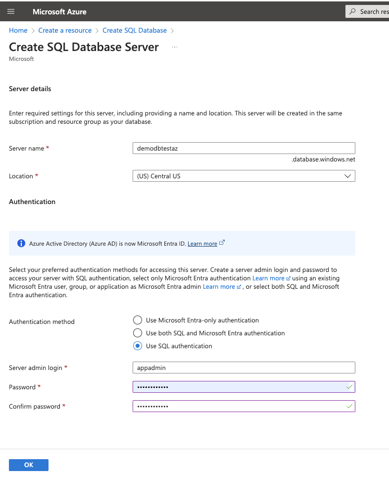
3. Select Server and click on Create a new server.

   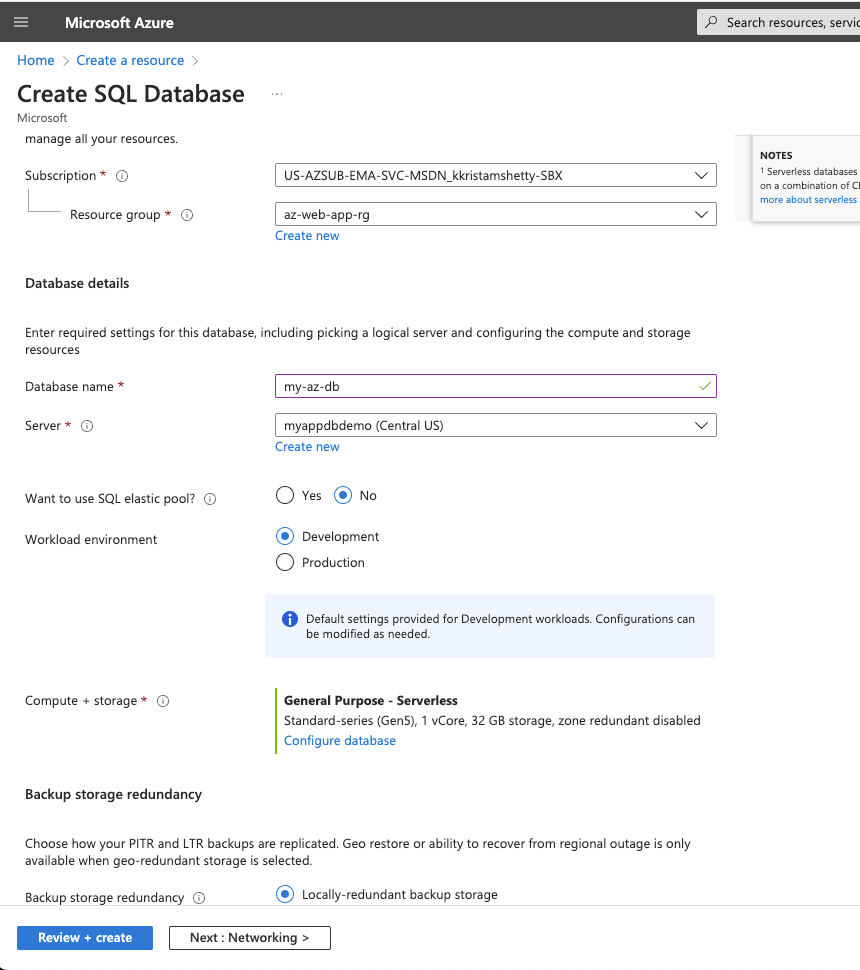
4. Fill in the details like Server name, Server admin login, Password, Confirm password, Location, Version, and click on Review + Create.
   
5. Under Networking, allow public access for access to db services.
   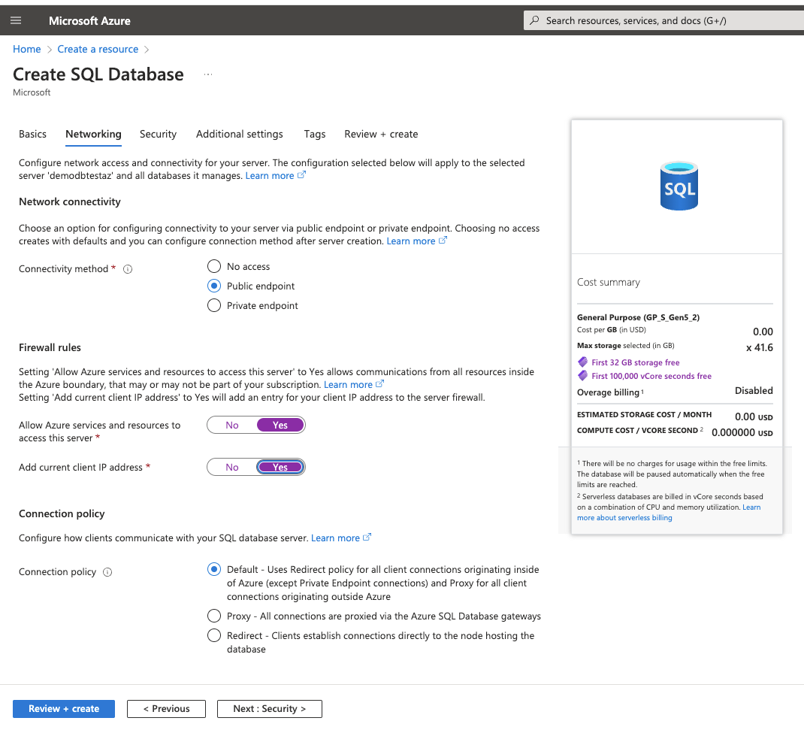
7. Click on Create and wait for the deployment to complete.
8. After deployment is successful, navigate to the resource and click on Query editor.

    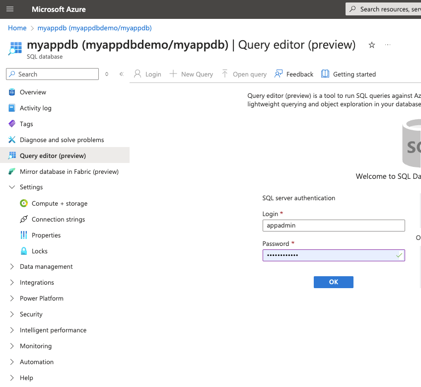 
9. You can also connect to the database by using Azure Data Studio or SQL Server Management Studio.
    
10. Copy the ServerName from the database (as shown below) and switch to azure data studio.
    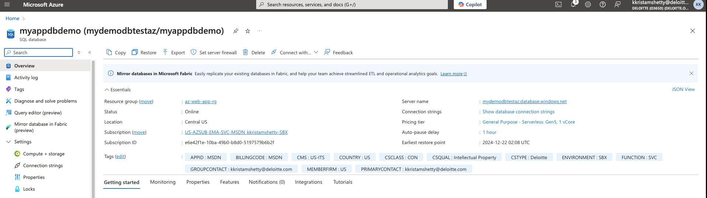
11. Open Azure Data Studio and click on New Connection.
    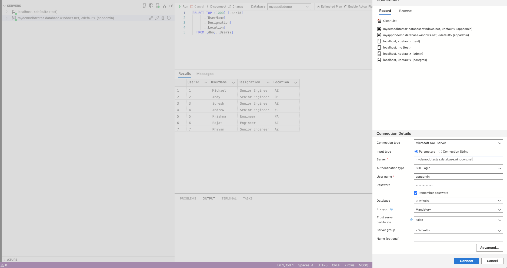


9. Connect to the database using the Server admin login and password.
10. Create a new database and a table. You can run the below script to create a table and insert some data.
    ```
    Create Table [dbo].[Users2] (UserId int, UserName varchar(100), Designation varchar(100),Location varchar(50));
    GO
    Insert INTO Users2(UserId, UserName, Designation, Location) VALUES(1,'Michael','Senior Engineer','AZ');
    Insert INTO Users2(UserId, UserName, Designation, Location) VALUES(2,'Andy','Senior Engineer','OH');
    Insert INTO Users2(UserId, UserName, Designation, Location) VALUES(3,'Suresh','Senior Engineer','AZ');
    Insert INTO Users2(UserId, UserName, Designation, Location) VALUES(4,'Andrew','Senior Engineer','FL');
    Insert INTO Users2(UserId, UserName, Designation, Location) VALUES(5,'Krishna','Engineer','PA');
    Insert INTO Users2(UserId, UserName, Designation, Location) VALUES(6,'Rajat','Engineer','AZ');
    Insert INTO Users2(UserId, UserName, Designation, Location) VALUES(7,'Khayam','Senior Engineer','AZ');    
    GO
    SELECT * FROM Users2;
    ```
    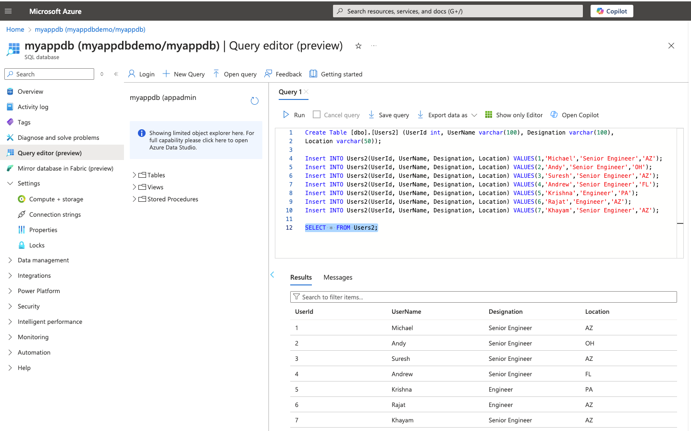
11. You can see the data in the table.
12. Now, let's connect to the database from the local machine.
13. Open appsettings.json file and update the connection string with the server name, database name, user id, and password.
    ```
    "ConnectionStrings": {
    "AZURE_SQL_CONNECTIONSTRING": "Server=tcp:myappdbdemo.database.windows.net,1433;Initial Catalog=myappdb;Persist Security Info=False;User ID=appadmin;Password=Password#123;MultipleActiveResultSets=False;Encrypt=True;TrustServerCertificate=False;Connection Timeout=30;"
    }
    ```
14. You can see the connection strings from azure sql database as below.
    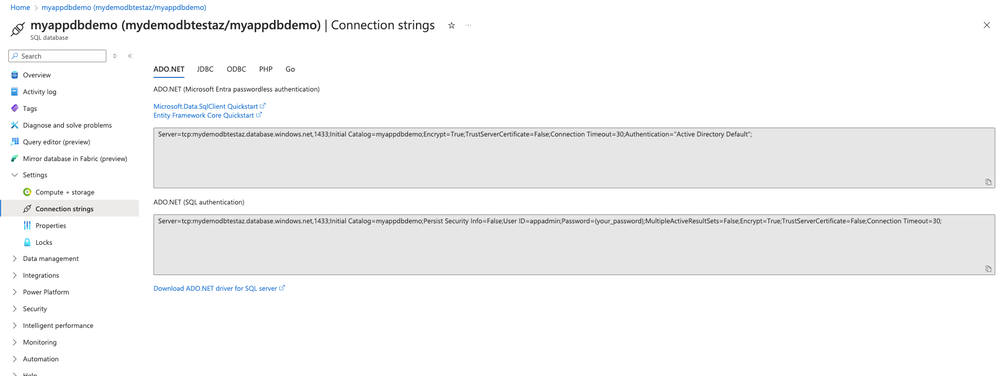
14. Use the above connection string in the code as below.
    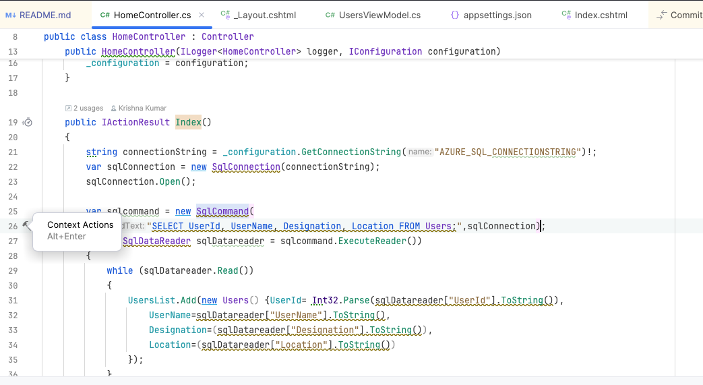
    
15. Run the project and you can see the data from the Azure SQL database.
    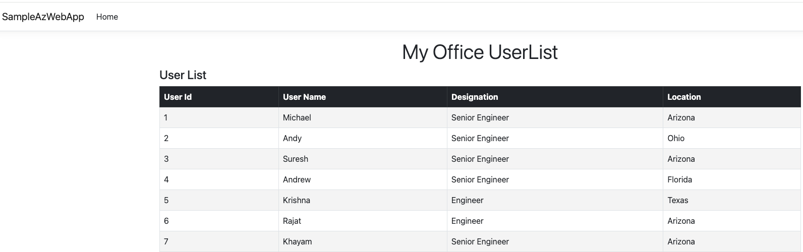
16. Now let's deploy the project to Azure Web App.
17. Publish the project to a folder named Publish.
    ```
    dotnet publish -c Release -o ./bin/Publish
    ```
18. You can see the published files in the bin\Publish folder.
19. Now, let's deploy the published files to Azure Web App. 
    Select the Publish folder --> Tools --> Azure --> Deploy to Azure Web Apps.
20. Select the Web app from the web apps and click on Run
21. You should see the terminal running the deployment and once it is successful, you can see the web app running on Azure.
22. Now switch to the previous url, (https://myazdemoapp-dkajacbtbshyhwfe.centralus-01.azurewebsites.net) and you can see the deployed web app running on Azure.
    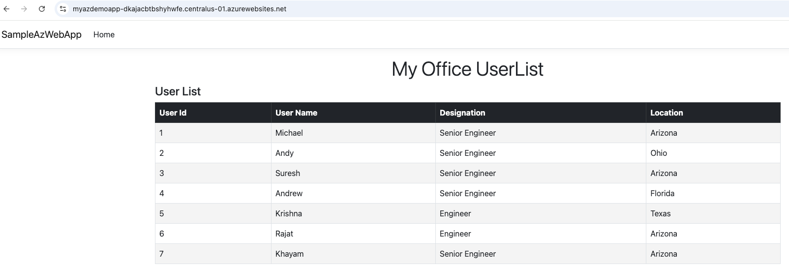
23. Now, you can see the above site is getting served from Azure Web App and the data is coming from Azure SQL Database.
24. You can remove the connection strings from the appsettings.json file and add them to the Azure App Configuration.
    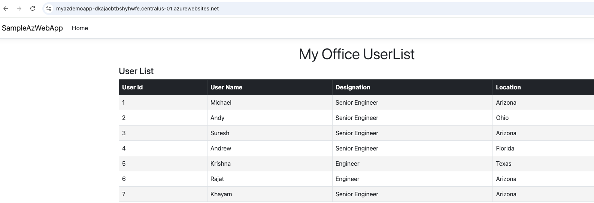
25. You can go to app , environment variables and add the connection strings, select the Type as SQL Azure.
    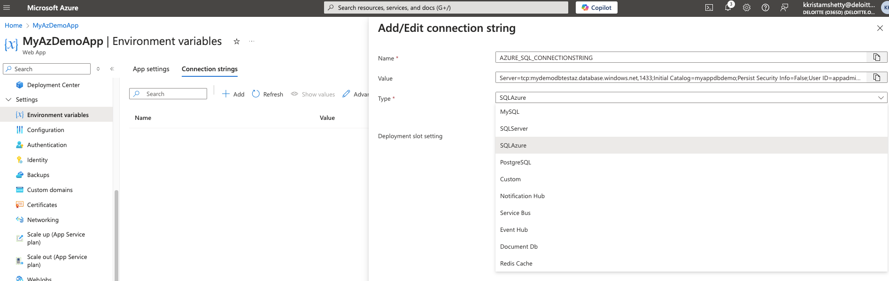
26. 